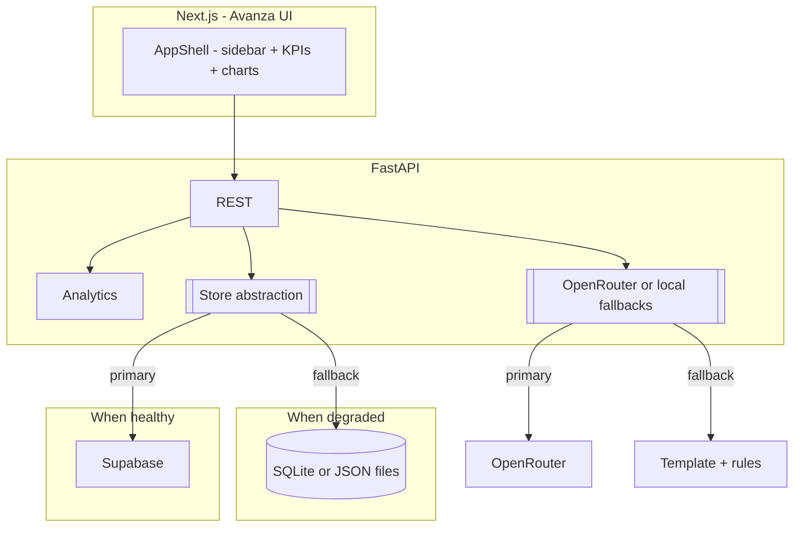

# API Health & SLA Monitor with AI Incident Summarizer

## Reference UI (must match for hackathon judge)

**Primary visual reference:** the high-fidelity mock you provided (dark **navy/charcoal** background, "avanza BANKING" branding, "AI Powered" pill, red/amber/green data accents, dense ops layout). **Place a copy in** `ME-AI/assets/reference-dashboard.png` (or keep your Cursor-assets copy open side-by-side) and implement the layout to match.

**Layout (single scrollable main area + left sidebar):**

- **Left sidebar (dark, narrow):** "avanza BANKING" wordmark, nav items: **Overview** (default active), **APIs**, **Alerts**, **Incident Reports**, **Log Search (AI)**, **Analytics**, **SLA & Policies**, **Jobs Monitor**, **Settings**. At bottom, small **user / Ops Team** block (name + role). *Hackathon scoping: most routes can be the same page with in-page anchors, or `dashboard/overview` only with the rest as placeholder sections.*
- **Top bar (main):** Title **"API Health & SLA Monitor"** and purple **"AI Powered"** badge. **Time range** select (e.g. Last 1 hour). **Auto-refresh** (e.g. 30s) toggle. **+ Add Widget** (optional: no-op for hackathon or opens simple dialog).
- **KPI row (5 cards):** Total APIs, Overall Uptime (with small green trend), Avg Response Time, Error Rate (Overall), **SLA Breach Risk** (donut: Red / Amber / Green counts e.g. 5 / 7 / 12).
- **Row 1 — two columns:**  
  - **API Health Overview:** wide table: API name + path, **Status** (e.g. Healthy, Degraded, Unstable, At Risk), **SLA Risk** pill, **P95** response time and delta %, **Error Rate** and delta, **Uptime 30m**, **30m trend** sparkline.  
  - **AI SLA Breach Predictor:** list rows with API, **High/Medium** risk tag, small trend sparkline, one-line text like *"X% chance of SLA breach in Y min"* (from analytics, not a second LLM call).
- **Row 2 — P95 line chart (large, bottom-left span):** multi-series lines for the main services (e.g. Payment Gateway, Fund Transfer, Account Balance, Customer Profile) over selected window. Payment Gateway should visually spike toward high ms (per dataset).
- **Row 3 — three areas:** **AI Log Search** (search input + "Search" button, results table: Time, API/Endpoint, Status, Response Time, Error Message, Request/Trace ID) | **Alert Timeline** (vertical feed: severity, API, **Open/Investigating/Resolved**, **assignee** name) | **AI Incident Report** card ("Generate New Report", 3-paragraph sample body, "Download Report (PDF)" as **browser print to PDF** or a stub for demo).

**Design tokens (Tailwind):** background `slate-950` / custom `#0B1220`, cards with subtle `border-slate-800`, text `slate-200`, muted `slate-500`, **green** `#22C55E`, **amber** `#F59E0B`, **red** `#EF4444`, **accent blue** for primary buttons/selection. Use **Recharts** for sparklines, donut, and the large line chart.

---

## Recommended Tech Stack

- **Frontend:** Next.js 14 (App Router) + TypeScript + Tailwind + shadcn/ui + Recharts. Dark theme as default. Match mock density (compact tables, `text-sm` where appropriate).
- **Backend:** Python FastAPI -- analytics, pluggable **storage** and **AI** providers.
- **AI (primary):** OpenRouter free-tier model IDs, OpenAI-compatible HTTP.
- **Database & auth (primary):** Supabase (Auth + Postgres + RLS).
- **Degraded / fallback (required):** see **Degraded mode and fallbacks** below.
- **Mock data:** [backend/data_generator.py](backend/data_generator.py) + [backend/data/api_logs.json](backend/data/api_logs.json).

---

## Degraded mode and fallbacks

### A. When Supabase is down, misconfigured, or unreachable

1. **Backend flag** `USE_LOCAL_STORE=1` (or auto-fallback: try Supabase on startup; on failure, log and switch to local).  
2. **Local persistence:** `sqlite` file e.g. `backend/local_store.db` (or JSON under `backend/data/sessions/`) with tables paralleling: `upload_sessions`, `api_logs`, `analysis_results`, `alerts` (no RLS; single-tenant for demo). Use **SQLAlchemy** or raw `sqlite3` with minimal schema matching the Supabase SQL.  
3. **Auth fallback:** if Supabase Auth cannot be used: **demo mode** -- env `DEMO_MODE=1` and `DEMO_BEARER_TOKEN=...` (long random string) or a simple **post** `/api/auth/dev-login` (only when `DEMO_MODE`) returning a signed JWT the backend already validates. Frontend shows a one-step "Continue as demo ops user" to skip sign-up. **Do not** ship demo login in production without gating.  
4. **API surface:** same REST routes; a thin **repository** layer `[backend/store/](backend/)` with `SupabaseStore` and `LocalStore` implementing the same methods.  
5. **User-visible signal:** a non-blocking **amber banner** at top: *"Running in local mode — data is stored on this machine only."*

### B. When OpenRouter fails, times out, rate-limits, or key is missing

1. **Timeouts:** 8–12s max per call; on failure, use fallbacks.  
2. **Incident report:** [backend/narrative.py](backend/narrative.py) (templated 3-paragraph text from `analytics` + top error strings + time window). **Pre-cache** one realistic paragraph set in a constant for instant demo.  
3. **Log search (NL):** [backend/nl_query.py](backend/nl_query.py) -- rules only: map *"5xx"*, *"last 2 hours"*, *503*, *endpoint* substring to SQL-like filters on in-memory/DB log rows. If OpenRouter was used for *filter extraction*, this path replaces that entirely in degraded AI.  
4. **User-visible signal:** small text under the incident panel: *"AI provider unavailable; showing rule-based report."*  
5. **Optional:** if `OPENROUTER_API_KEY` is empty, **skip** the HTTP call and go straight to template + rules (so judges can run without any key).

**Order of try for incident text:** OpenRouter (if key present) -> on error -> `narrative.py` -> on error -> `FALLBACK_INCIDENT_REPORT` constant.

### C. `GET /api/health` (backend) should return

- `store: "supabase" | "local"`
- `ai: "openrouter" | "local"`
- `version` -- so the UI can show the banner state without guessing.

---

## Architecture Overview



---

## Supabase Database Schema (primary)

Same as before: `upload_sessions`, `api_logs`, `analysis_results`, `alerts` + RLS. See earlier SQL in git history of this plan or replicate from project README during implementation.

**Local store:** mirror the same column names to simplify the repository pattern.

---

## Project Structure (UI-aligned)

```
ME-AI/
├── assets/                         # reference mock (already present)
├── backend/
│   ├── main.py
│   ├── config.py                  # feature flags, degraded mode
│   ├── data_generator.py
│   ├── ai_service.py              # OpenRouter + calls to narrative on failure
│   ├── narrative.py               # 3-paragraph template fallback
│   ├── nl_query.py                # rule-based NL for log search fallback
│   ├── analytics.py
│   ├── store/
│   │   ├── __init__.py
│   │   ├── supabase_store.py
│   │   └── local_store.py
│   ├── auth.py                    # Supabase JWT + demo/local JWT
│   ├── models.py
│   ├── requirements.txt           # add sqlalchemy or sqlite3 stdlib
│   └── data/api_logs.json
├── frontend/
│   ├── app/
│   │   ├── login/page.tsx
│   │   ├── dashboard/
│   │   │   ├── layout.tsx         # app shell, sidebar, banner slot
│   │   │   └── page.tsx           # or overview/page.tsx
│   │   ├── globals.css            # color tokens, dark base
│   │   └── layout.tsx
│   ├── components/
│   │   ├── app-shell.tsx          # sidebar + main + header controls
│   │   ├── kpi-row.tsx
│   │   ├── health-overview-table.tsx
│   │   ├── sla-breach-predictor-list.tsx
│   │   ├── p95-trend-chart.tsx
│   │   ├── ai-log-search.tsx
│   │   ├── alert-timeline.tsx
│   │   ├── incident-report-panel.tsx
│   │   ├── degraded-mode-banner.tsx
│   │   ├── log-upload.tsx
│   │   └── session-picker.tsx
│   ├── lib/
│   │   ├── api.ts
│   │   └── supabase.ts
│   └── middleware.ts
└── README.md
```

---

## Implementation Plan (3.5 hours)

### Phase 1: Foundation (55 min)

- **Supabase** setup + **local** store skeleton + `config.py` flags.
- **Mock dataset** + `GET /api/health` + store abstraction.
- **FastAPI** routes unchanged conceptually, but all DB access through `store` methods.
- **Auth:** Supabase JWT; add demo token path if `DEMO_MODE`.

### Phase 2: Analytics + AI (50 min)

- **Analytics** -- include **time-to-breach** and **SLA risk counts** for donut + predictor copy.
- **ai_service** -- OpenRouter; wire **narrative** + **nl_query** on failure; optional keyless template-only.
- **Alerts** with optional `assignee` field (string) for UI parity with mock.

### Phase 3: Frontend - Avanza shell (90 min)

- **Tailwind** theme + **app-shell** with sidebar, nav, Ops Team footer.
- **KPI** row, **API Health** table, **SLA Breach** list, **P95** chart, **log search** + table, **alert** timeline, **incident** panel, **degraded** banner (reads `/api/health`).
- **Global** time range + **30s** auto-refresh (re-fetch from API or client-side filter on cached session data depending on time budget).

### Phase 4: Polish (25 min)

- End-to-end: primary (Supabase + OpenRouter) and **flip flags** to verify local + template paths.
- README: env vars, **hackathon runbook** (2-minute judge path: demo without keys).

---

## Data Flow (with fallbacks)

The existing sequence for Supabase + OpenRouter stands. Add:

- If `OpenRouter` errors -> FastAPI returns templated report and sets response header or JSON field `ai_mode: "template"`.  
- If `Supabase` errors on write -> retry once; else persist to `LocalStore` and return `store: "local"`.

---

## Key Decisions

- **UI fidelity** to the provided mock is a first-class deliverable; functionality maps to the same regions of the page.
- **Repository pattern** for store + **defensive** AI allow live demos with zero cloud and zero LLM key.
- **Supabase** remains the primary store for a realistic multi-user story; **local** is the safety net.

---

## Environment Variables

```env
# backend/.env
SUPABASE_URL=...
SUPABASE_KEY=...           # service role
SUPABASE_JWT_SECRET=...
OPENROUTER_API_KEY=...     # optional: if empty, use template+rules for AI
USE_LOCAL_STORE=0         # 1 to force local SQLite from the start
DEMO_MODE=0               # 1 to enable dev/demo login
DEMO_BEARER_TOKEN=...     # if DEMO_MODE

# frontend/.env.local
NEXT_PUBLIC_SUPABASE_URL=...
NEXT_PUBLIC_SUPABASE_ANON_KEY=...
NEXT_PUBLIC_API_URL=http://localhost:8000
```

---

## Environment Setup

Same as before; add `sqlalchemy` or use stdlib `sqlite3`. For PDF download: `window.print()` on the report `div` or a minimal `jspdf` only if time allows; mock shows a button that must not block the demo (print is enough).

---

## Risk Mitigations (updated)

- **OpenRouter** -- template + rules + constant sample; key optional.  
- **Supabase** -- `LocalStore` + demo token; same UI.  
- **Time** -- collapse secondary nav to anchors on one `dashboard` page.  
- **CORS** -- allow frontend origin.  
- **Scope** -- "Add Widget" and secondary nav items can be non-functional with tooltip "coming soon".

---

## What this revision added

- **Degraded** plans for both **Supabase** and **OpenRouter** (local store + template/rules + optional demo auth).  
- **UI** section that mirrors the **attached mock** (sidebar, KPIs, table, predictor, chart, log search, alerts, incident, controls).  
- **Todos and structure** updated for `app-shell`, `degraded-mode-banner`, `kpi-row`, and store abstraction.
